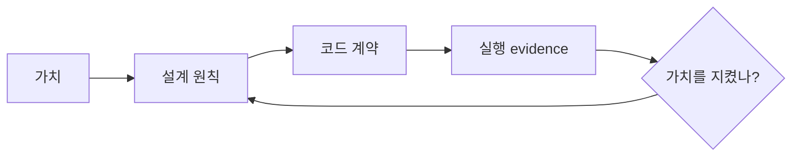

# 3장: 가치에서 구현까지

원 연구의 특징은 코드 패턴을 곧바로 모범 답안으로 만들지 않는 데 있다. 먼저
사람이 지키고 싶은 가치를 놓고, 그 가치가 설계 원칙과 구현으로 어떻게 내려오는지
추적한다.

## 다섯 가치

| 가치 | Claude Code에서 보이는 의미 |
| --- | --- |
| 인간의 결정 권한 | 목표, 승인과 중단의 최종 권한은 사용자에게 있다 |
| 안전·보안·프라이버시 | 사용자가 모든 경고를 주의 깊게 읽지 않아도 시스템이 보호한다 |
| 신뢰할 수 있는 실행 | 수집하고 행동한 뒤 결과를 다시 검증한다 |
| 능력 증폭 | 모델을 과도한 절차로 묶지 않고 강한 하니스로 뒷받침한다 |
| 맥락 적응 | 프로젝트 지침과 신뢰 수준이 환경에 따라 달라진다 |

## 열세 설계 원칙

원 연구는 다음 원칙을 제시한다.

1. deny 우선과 인간에게의 escalation
2. 단계적으로 높아지는 신뢰
3. 서로 겹치는 심층 방어
4. 파일과 훅으로 외부화된 정책
5. 희소 자원으로서의 컨텍스트
6. append-only 지속 상태
7. 최소 scaffolding과 최대 harness
8. 고정 절차보다 가치 기반 판단
9. 비용이 다른 복수의 확장 메커니즘
10. 되돌릴 수 있는 행동을 더 가볍게 다루는 위험 평가
11. 사용자가 읽을 수 있는 파일 기반 설정과 메모리
12. 격리된 서브에이전트 경계
13. 실패를 전제로 한 복구와 회복력

이 원칙은 서로 독립된 체크리스트가 아니다. 예를 들어 파일 기반 메모리는
투명성을 높이지만 검색 능력은 제한한다. 그래서 별도의 LLM relevance scan이
그 단순한 저장 방식을 보완한다. 한 설계 선택은 다른 선택의 비용을 만든다.



## 실제 source: 결정 이유의 provenance

```typescript
export type PermissionDecisionReason =
  | { type: 'rule'; rule: PermissionRule }
  | { type: 'mode'; mode: PermissionMode }
  | { type: 'hook'; hookName: string; reason?: string }
  | { type: 'classifier'; classifier: string }
```

실제 union에는 subcommand, prompt tool, async agent와 sandbox 이유도 있다.
[`PermissionDecisionReason`][actual-reason]은 허용/거부만 남기지 않고 어떤
경계가 결정했는지를 보존한다. 가치가 구현으로 내려왔는지는 결과 문자열보다
이 provenance에서 더 정확하게 검증할 수 있다.

## 승인 피로가 가르치는 것

승인 요청의 93%가 검토 없이 허용됐다면 경고를 더 많이 띄우는 것이 답이 아니다.
사용자가 반복 판단하지 않아도 되는 안전 구역을 샌드박스와 분류기로 만들고,
되돌리기 어려운 행동에 집중해서 승인받아야 한다.

인간 중심 설계는 모든 이벤트를 사람에게 던지는 것이 아니다. 모델과 사람 모두가
판단에 필요한 원본을 잃지 않되, 사람이 실제로 판단해야 하는 경계가 선명해야 한다.

## 원문으로 돌아가기

- [README: Values and Design Principles][values]
- [Build Your Own Agent: 설계 결정][builder]

[values]: https://github.com/VILA-Lab/Dive-into-Claude-Code/blob/ab04bc85e4920ceef2a8a47c069524d3bc9fec22/README.md
[builder]: https://github.com/VILA-Lab/Dive-into-Claude-Code/blob/ab04bc85e4920ceef2a8a47c069524d3bc9fec22/docs/build-your-own-agent.md
[actual-reason]: https://github.com/codeaashu/claude-code/blob/6a2590911df240ff5ea56aa355696cfb94d128cb/src/types/permissions.ts#L268-L310
