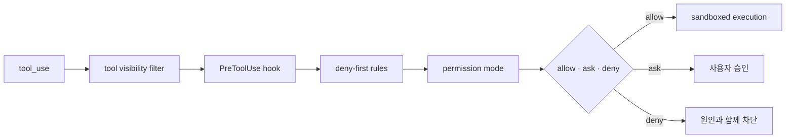

# 4장: 권한과 심층 방어

Claude Code의 안전 모델은 하나의 승인 창이 아니다. 요청은 적용 가능한 모든
안전 계층을 통과해야 하며, 한 계층이라도 막으면 실행되지 않는다.

## 일곱 안전 계층

1. 금지된 도구를 모델의 도구 목록에서 먼저 제거한다.
2. deny 규칙이 allow 규칙보다 항상 우선한다.
3. 현재 permission mode가 기본 행동을 제한한다.
4. auto mode에서는 별도 모델 분류기가 위험을 평가한다.
5. 셸 실행은 파일시스템과 네트워크 샌드박스를 거친다.
6. 재개한 세션은 이전 권한을 자동 복원하지 않는다.
7. `PreToolUse` 훅이 입력을 수정하거나 실행을 차단할 수 있다.

## 단계적 신뢰

`plan`, `default`, `acceptEdits`, `auto`, `dontAsk`,
`bypassPermissions`는 단순한 편의 옵션이 아니다. 사용자가 작업과 환경을 얼마나
신뢰하는지 표현하는 스펙트럼이다. 내부 `bubble` 모드는 서브에이전트의 결정을
상위 조정자에게 올린다.



## 실제 source: 질문은 실행이 아니다

```typescript
export type PermissionResult<Input> =
  | PermissionDecision<Input>
  | {
      behavior: 'passthrough'
      message: string
      pendingClassifierCheck?: PendingClassifierCheck
    }
```

[`PermissionResult`][actual-permission]의 `passthrough`는 상위 handler가 결정을
이어받아야 한다는 뜻이다. 이를 allow로 바꾸거나, 승인 UI를 별도 새 세션으로
투사하면 원래 permission protocol을 깨뜨린다.

## 공유 실패 모드

방어층이 많다고 자동으로 안전해지지는 않는다. 여러 계층이 같은 토큰 비용,
파서나 이벤트 루프 한계에 의존하면 하나의 제약이 동시에 여러 방어를 약화시킨다.
원 연구는 긴 복합 명령의 보안 분석이 성능 제약 때문에 우회될 수 있는 사례를
통해 이 점을 경고한다.

## 재개의 의미

대화 내용과 세션 ID를 재사용하는 것과 권한을 재사용하는 것은 다르다. 세션은
계속되더라도 실행 환경과 사용자 의도는 달라질 수 있다. 그래서 권한을 다시
확립한다. 지속성과 신뢰를 같은 필드로 묶지 않는 것이 안전 불변식이다.

![권한 게이트][permission]

## 원문으로 돌아가기

- [Architecture: Seven Independent Safety Layers][architecture]
- [README: Safety and Permissions][readme]

[architecture]: https://github.com/VILA-Lab/Dive-into-Claude-Code/blob/ab04bc85e4920ceef2a8a47c069524d3bc9fec22/docs/architecture.md
[readme]: https://github.com/VILA-Lab/Dive-into-Claude-Code/blob/ab04bc85e4920ceef2a8a47c069524d3bc9fec22/README.md
[permission]: https://raw.githubusercontent.com/VILA-Lab/Dive-into-Claude-Code/ab04bc85e4920ceef2a8a47c069524d3bc9fec22/assets/permission.png
[actual-permission]: https://github.com/codeaashu/claude-code/blob/6a2590911df240ff5ea56aa355696cfb94d128cb/src/types/permissions.ts#L241-L266
