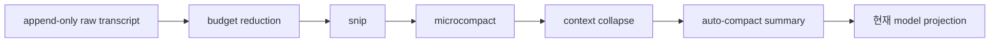

# 5장: 컨텍스트는 가장 희소한 자원이다

원 연구는 컨텍스트 창을 Claude Code 아키텍처의 **binding constraint**로 본다.
도구 지연 로딩, 서브에이전트 요약, 메모리 선택과 결과 크기 제한은 모두 유한한
컨텍스트를 오래 유지하기 위한 선택이다.

## 아홉 개의 입력 층

시스템 프롬프트, 환경 정보, CLAUDE.md 계층, 경로별 규칙, 자동 메모리, 도구
메타데이터, 대화 기록, 도구 결과와 compact summary가 순서대로 현재 모델 입력을
구성한다.

CLAUDE.md는 중요한 지침이지만 system prompt와 같은 강제 규칙이 아니다. 사용자
컨텍스트로 전달되어 확률적으로 준수된다. 강제해야 하는 보안 정책은 permission
rule과 샌드박스가 맡는다.

## 다섯 단계 압축

가장 덜 파괴적인 방법부터 순서대로 적용한다.

1. 메시지별 예산을 줄인다.
2. 오래된 이력을 잘라 낸다.
3. 캐시를 고려해 미세 압축한다.
4. 원본을 지우지 않고 읽을 때 가상 projection을 만든다.
5. 마지막 수단으로 모델이 전체 요약을 만든다.

이 설계는 압축 성공을 “원래 대화가 사라졌다”는 뜻으로 만들지 않는다. 원본
transcript는 append-only로 남고, 현재 모델이 보는 projection만 달라진다.



## 실제 source: 값싼 압축부터

```typescript
const snipResult = await deps.snip(messagesForQuery, querySource)
messagesForQuery = snipResult.messages
const microcompactResult = await deps.microcompact(
  messagesForQuery,
  querySource,
)
messagesForQuery = microcompactResult.messages
```

[`queryLoop()` 압축 구간][actual-compact]은 snip 뒤 microcompact를 적용하고,
그 다음 context collapse와 autocompact를 검사한다. 다이어그램의 다섯 단계가
동시에 실행되는 단일 “압축 상태”가 아니라, 조건과 비용이 다른 순차 projection인
이유를 코드에서 확인할 수 있다.

## 파일 기반 메모리

Claude Code 메모리는 벡터 데이터베이스가 아니라 사람이 열 수 있는 파일이다.
모델은 파일 헤더를 읽고 관련성이 높은 항목을 선택한다. 검색 성능보다 다음
가치를 우선한다.

- 사용자가 무엇을 기억하는지 직접 확인한다.
- 편집하고 삭제할 수 있다.
- 버전 관리할 수 있다.
- 에이전트의 자기 보고에 의존하지 않는다.

![컨텍스트 조립][context]

## 원문으로 돌아가기

- [Architecture: Context Construction and Memory][architecture]
- [Build Your Own Agent: How Do You Manage Context?][builder]

[architecture]: https://github.com/VILA-Lab/Dive-into-Claude-Code/blob/ab04bc85e4920ceef2a8a47c069524d3bc9fec22/docs/architecture.md
[builder]: https://github.com/VILA-Lab/Dive-into-Claude-Code/blob/ab04bc85e4920ceef2a8a47c069524d3bc9fec22/docs/build-your-own-agent.md
[context]: https://raw.githubusercontent.com/VILA-Lab/Dive-into-Claude-Code/ab04bc85e4920ceef2a8a47c069524d3bc9fec22/assets/context.png
[actual-compact]: https://github.com/codeaashu/claude-code/blob/6a2590911df240ff5ea56aa355696cfb94d128cb/src/query.ts#L396-L468
