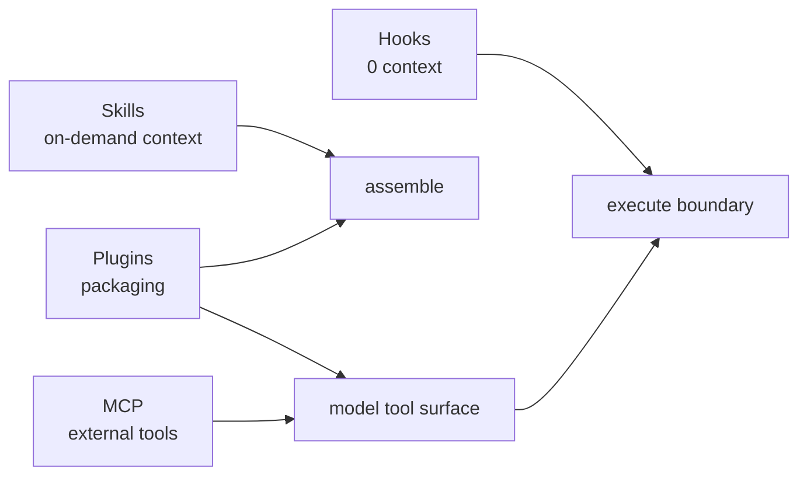

# 6장: 네 가지 확장 메커니즘

원 연구는 확장을 하나의 플러그인 API로 통합하지 않는다. 확장이 모델
컨텍스트와 실행 환경에 미치는 비용이 서로 다르기 때문이다.

| 메커니즘 | 컨텍스트 비용 | 역할 |
| --- | ---: | --- |
| Hooks | 0 | 수명 주기 관찰, 차단과 외부 자동화 |
| Skills | 낮음 | 필요할 때 현재 컨텍스트에 절차를 주입 |
| Plugins | 중간 | 명령, 에이전트, 스킬, 훅, MCP와 설정을 패키징 |
| MCP | 높음 | 외부 도구와 리소스를 새로운 실행 표면으로 제공 |

## 세 개의 주입 지점

1. **assemble()**: 모델이 무엇을 보는가
2. **model()**: 모델이 어떤 도구에 접근할 수 있는가
3. **execute()**: 호출이 실제로 허용되고 어떻게 실행되는가

도구 설명과 스킬은 모델의 다음 행동을 유도하지만 실행 결과를 대신하지 않는다.
권한 훅은 실행을 차단할 수 있지만 모델에게 거짓 성공을 반환해서는 안 된다.
MCP는 도구를 제공하지만 그것을 언제 쓸지는 모델과 현재 목표가 판단한다.

## 도구 풀 조립

기본 도구 열거 → 실행 모드 필터 → deny 규칙 필터 → MCP 통합 → 중복 제거의
순서로 모델에게 보일 도구가 결정된다. “코드에 도구가 존재한다”와 “현재 세션의
모델이 그 도구를 볼 수 있다”는 다른 사실이다.



## 실제 source: self-describing tool contract

```typescript
type DefaultableToolKeys =
  | 'isEnabled'
  | 'isConcurrencySafe'
  | 'isReadOnly'
  | 'isDestructive'
  | 'checkPermissions'
  | 'userFacingName'
```

[`ToolDef`][actual-tool]은 각 tool이 실행 함수만이 아니라 활성화 조건, 동시성,
파괴성, permission과 표시 이름을 함께 선언하게 한다. `buildTool()`은 빠진
기본값을 채우지만, 실제 실행 결과나 위험도를 host가 임의로 재해석하지 않는다.

## SkillTool과 AgentTool

SkillTool은 현재 컨텍스트에 지침을 넣는다. AgentTool은 별도 컨텍스트를 가진
실행자를 만든다. 같은 Markdown을 읽는 것처럼 보여도 비용과 격리 경계가 전혀
다르다.

![확장 주입 지점][extensibility]

## 원문으로 돌아가기

- [README: Extensibility][readme]
- [Architecture: Extensibility][architecture]

[readme]: https://github.com/VILA-Lab/Dive-into-Claude-Code/blob/ab04bc85e4920ceef2a8a47c069524d3bc9fec22/README.md
[architecture]: https://github.com/VILA-Lab/Dive-into-Claude-Code/blob/ab04bc85e4920ceef2a8a47c069524d3bc9fec22/docs/architecture.md
[extensibility]: https://raw.githubusercontent.com/VILA-Lab/Dive-into-Claude-Code/ab04bc85e4920ceef2a8a47c069524d3bc9fec22/assets/extensibility.png
[actual-tool]: https://github.com/codeaashu/claude-code/blob/6a2590911df240ff5ea56aa355696cfb94d128cb/src/Tool.ts#L704-L726
