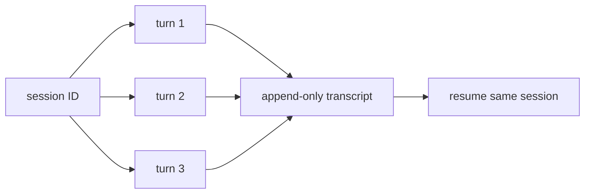

# 8장: 세션, 메모리와 재개

Claude Code의 지속성은 하나의 데이터베이스 행이 아니다. 서로 다른 목적을 가진
세 채널이 있다.

| 채널 | 역할 |
| --- | --- |
| session transcript | 한 세션의 전체 메시지와 compact 경계 |
| global prompt history | 세션을 넘나드는 사용자 프롬프트 탐색 |
| subagent sidechain | 하위 실행의 격리된 전체 기록 |

## Append-only를 선택한 이유

JSONL은 복잡한 질의에는 불리하다. 대신 한 이벤트씩 추가되고 기존 원본을
파괴하지 않으므로 감사와 복원이 쉽다. compact 전후 연결도 원본을 다시 쓰지 않고
읽는 시점에 chain을 patch한다.

## 세션 재사용의 계약

재개는 같은 session ID와 대화 이력을 이어 쓰는 것이다. 매 사용자 메시지마다
새 세션을 만드는 것은 재개가 아니다. 반대로 같은 세션을 쓴다고 모든 run과 turn을
하나로 합쳐서는 안 된다.

- session: 지속되는 대화와 원격 실행의 식별자
- turn: 하나의 사용자 입력과 그에 대한 실행
- run: 제품이 묶어 보여 주는 장기 작업 범위

턴 종료 신호를 세션 종료로 해석하면 멀티턴 대화가 깨진다.



## 실제 source: session ID와 경로를 함께 전환

```typescript
export function switchSession(
  sessionId: SessionId,
  projectDir: string | null = null,
): void {
  STATE.sessionId = sessionId
  STATE.sessionProjectDir = projectDir
  sessionSwitched.emit(sessionId)
}
```

실제 함수는 이전 session의 plan-slug cache도 먼저 정리한다.
[`switchSession()`][actual-session]이 ID와 transcript directory를 원자적으로
바꾸는 이유는 다른 project나 worktree의 session을 재개할 때 둘이 어긋나지
않게 하기 위해서다. 입력마다 `regenerateSessionId()`를 호출하면 이 계약을
사용하지 않은 것이다.

## 권한은 복원하지 않는다

대화는 재개하지만 권한은 현재 환경에서 다시 확인한다. 이전 세션의 trust를
조용히 되살리지 않는 것이 안전 경계다.

![세션과 압축][session]

## 원문으로 돌아가기

- [README: Session Persistence][readme]
- [Architecture: Session Persistence][architecture]

[readme]: https://github.com/VILA-Lab/Dive-into-Claude-Code/blob/ab04bc85e4920ceef2a8a47c069524d3bc9fec22/README.md
[architecture]: https://github.com/VILA-Lab/Dive-into-Claude-Code/blob/ab04bc85e4920ceef2a8a47c069524d3bc9fec22/docs/architecture.md
[session]: https://raw.githubusercontent.com/VILA-Lab/Dive-into-Claude-Code/ab04bc85e4920ceef2a8a47c069524d3bc9fec22/assets/session_compact.png
[actual-session]: https://github.com/codeaashu/claude-code/blob/6a2590911df240ff5ea56aa355696cfb94d128cb/src/bootstrap/state.ts#L456-L481
