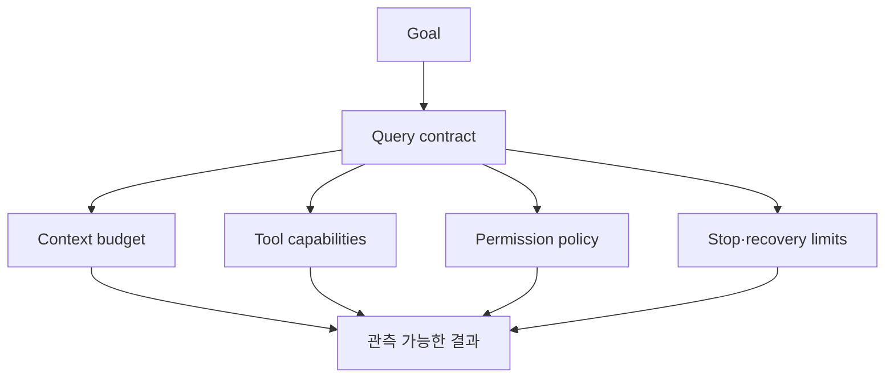

# 9장: 나만의 에이전트를 설계하는 질문

원본의 `Build Your Own AI Agent`는 코딩 튜토리얼이 아니다. Claude Code의 답을
복제하기 전에 자신의 제품이 어떤 설계 공간에 있는지 묻는 안내서다.

## 판단은 어디에 둘 것인가

- 모델에 넓은 판단권을 주고 하니스가 경계를 강제할 것인가?
- 명시적 상태 그래프로 흐름을 고정할 것인가?
- 장기 계획기와 task tracker를 둘 것인가?

규제된 반복 업무에는 상태 그래프가 유리할 수 있다. 빠르게 발전하는 범용 모델에
과도한 scaffolding을 쌓으면 모델이 좋아질수록 그것이 기술 부채가 될 수 있다.

## 안전 경계는 무엇인가

승인 창, 컨테이너, git rollback과 심층 방어는 서로 보호하는 범위가 다르다.
파일을 되돌릴 수 있다고 네트워크 전송이나 외부 서비스 변경까지 되돌릴 수 있는
것은 아니다.

## 컨텍스트를 어떻게 유지할 것인가

단순 자르기, sliding window, RAG, 단일 요약과 단계적 compaction 중 무엇을
선택할지 결정해야 한다. 몇 시간짜리 작업을 지원한다면 초기부터 압축과 원본
보존을 함께 설계해야 한다.

## 확장을 어떤 비용으로 제공할 것인가

모든 확장을 full tool schema로 넣으면 컨텍스트가 무너진다. 관찰만 필요한 것은
hook, 필요할 때만 읽을 절차는 skill, 외부 행동은 MCP처럼 비용과 책임을
분리한다.

## 서브에이전트와 세션

하위 실행이 문맥을 공유할지, 요약만 돌려줄지, 메시지 프로토콜을 쓸지 정해야
한다. 세션 저장도 stateless, DB, append-only 파일 사이에서 감사 가능성과 질의
능력을 선택해야 한다.

## 반복되는 세 약속

원 연구는 Claude Code의 여러 설계에서 세 약속을 발견한다.

1. 하나의 거대한 메커니즘보다 단계적 계층
2. 질의 편의보다 원본 감사 가능성을 택한 append-only
3. 결정론적 하니스 안에서 사용하는 모델 판단



## 실제 source: loop에 들어가기 전의 계약

```typescript
export type QueryParams = {
  messages: Message[]
  systemPrompt: SystemPrompt
  canUseTool: CanUseToolFn
  toolUseContext: ToolUseContext
  maxTurns?: number
  taskBudget?: { total: number }
}
```

실제 타입에는 user/system context, fallback model과 cache 설정도 있다.
[`QueryParams`][actual-contract]는 model 선택 하나가 agent 설계가 아님을
보여 준다. 목표를 실행 가능한 시스템으로 만들려면 context, capability,
permission, turn과 budget 경계를 함께 명시해야 한다.

## 설계 워크시트

새 agent를 만들기 전에 위 그래프의 각 화살표에 대해 “누가 소유하는가”,
“무슨 실제 event로 검증하는가”, “실패하면 무엇을 반환하는가”를 한 문장씩
작성한다. 답이 없는 부분은 prompt로 덮지 말고 아직 구현되지 않은 경계로 남긴다.

## 원문으로 돌아가기

- [Build Your Own AI Agent: 전문][builder]

[builder]: https://github.com/VILA-Lab/Dive-into-Claude-Code/blob/ab04bc85e4920ceef2a8a47c069524d3bc9fec22/docs/build-your-own-agent.md
[actual-contract]: https://github.com/codeaashu/claude-code/blob/6a2590911df240ff5ea56aa355696cfb94d128cb/src/query.ts#L181-L217
