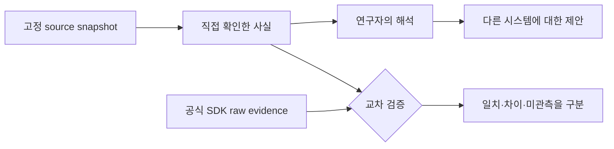

# 10장: 연구의 한계와 후속 자료

이 연구는 Claude Code의 특정 버전과 당시 확인 가능한 소스, 커뮤니티 분석을
기준으로 한다. 기능 이름, 도구 수, permission mode와 내부 경로는 이후 버전에서
달라질 수 있다.

## 세 등급으로 읽기

1. **원본에서 직접 확인한 구조**: 고정 commit의 코드와 문서가 지지한다.
2. **연구자의 해석**: 구조에서 가치와 설계 원칙을 도출한다.
3. **다른 시스템으로의 제안**: 에이전트 구축자가 선택할 설계 공간이다.

세 등급을 한 문장에서 “Claude Code가 공식적으로 이렇게 설계됐다”고 합치지
않는다. 역공학 연구는 구현을 관찰할 수 있지만 Anthropic의 원래 의사결정 과정
전체를 증명하지는 않는다.



## 실제 source가 말할 수 있는 범위

```typescript
export type TranscriptMessage = SerializedMessage & {
  parentUuid: UUID | null
  isSidechain: boolean
  agentId?: string
  teamName?: string
  promptId?: string
}
```

[`TranscriptMessage`][actual-transcript]는 source snapshot에서 parent,
sidechain, agent/team과 OTel prompt correlation이 저장된다는 사실을
지지한다. 그러나 이것만으로 특정 팀이 실제 실행됐거나 공식 SDK가 같은 필드를
보장한다고 말할 수는 없다. 실제 session evidence와 공식 문서를 별도로 확인해야
한다.

## 함께 볼 자료

- 원 논문과 PDF
- 원 저장소의 architecture deep dive
- agent builder design guide
- 관련 프로젝트와 연구 목록
- 다른 에이전트 시스템과의 비교

한국어판의 목적은 원문을 대신하는 것이 아니라 학생이 원문을 더 정확하게 읽을
수 있게 하는 것이다. 수치와 세부 기능을 인용할 때는 항상 고정 원문을 다시
확인한다.

## 원문으로 돌아가기

- [Dive into Claude Code 원 저장소][repo]
- [arXiv 논문][paper]
- [관련 자료 모음][resources]

[repo]: https://github.com/VILA-Lab/Dive-into-Claude-Code
[paper]: https://arxiv.org/abs/2604.14228
[resources]: https://github.com/VILA-Lab/Dive-into-Claude-Code/blob/ab04bc85e4920ceef2a8a47c069524d3bc9fec22/docs/related-resources.md
[actual-transcript]: https://github.com/codeaashu/claude-code/blob/6a2590911df240ff5ea56aa355696cfb94d128cb/src/types/logs.ts#L221-L231
